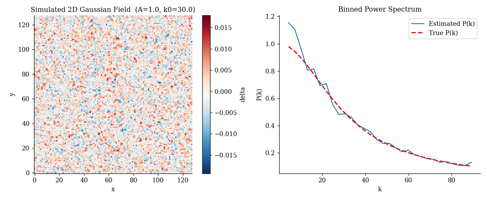
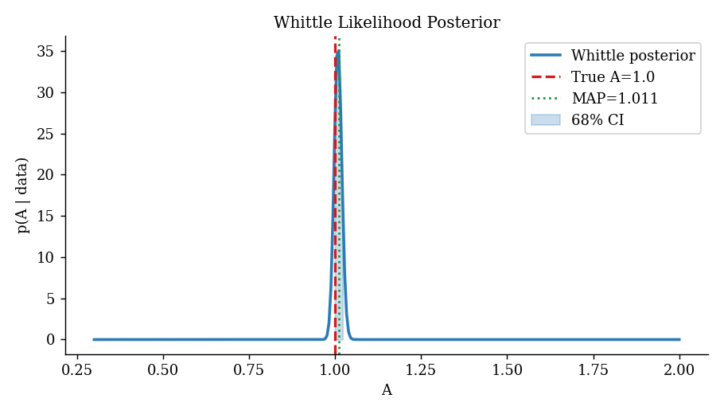
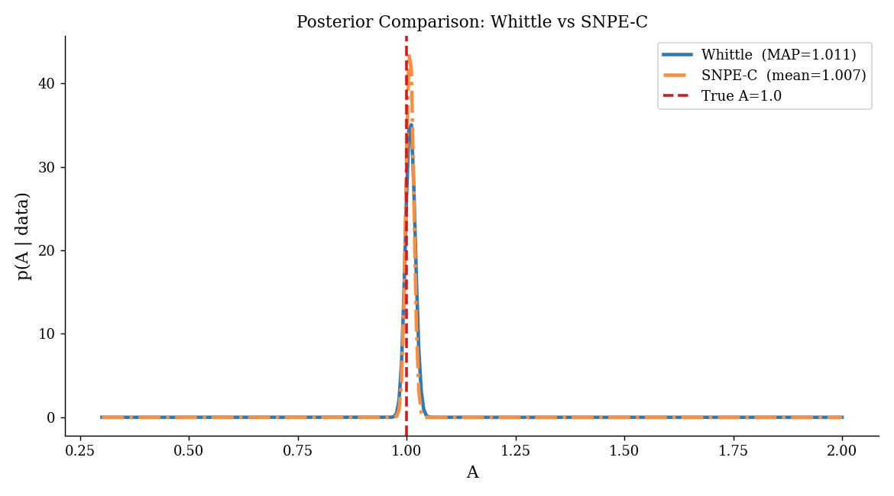
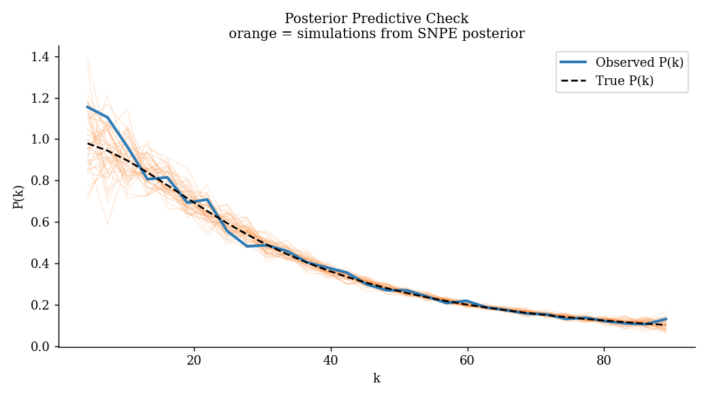

# Simulation-Based Inference on 2D Gaussian Random Fields

This repository documents a self-directed learning project on simulation-based inference (SBI), built during the gap between my MSc and PhD applications. I wanted to understand the core ideas practically before encountering them in a research setting.

My MSc dissertation involved bispectrum estimation and window function convolution for DESI galaxy mocks. The natural next question is how to do parameter inference from statistics like that — SBI is one answer, and this project is my attempt to learn how it works.

---

## The Problem

The setup is a 2D isotropic Gaussian random field with a Lorentzian power spectrum:

$$P(k) = \frac{A}{1 + (k/k_0)^2}$$

The characteristic wavenumber $k_0$ is assumed known. The goal is to recover the amplitude $A$ from a single field realisation. This is a one-parameter inference problem with a tractable analytical solution, which makes it a useful testbed — the neural approach can be validated against something we trust.

---

## Methods

### 1. Whittle Likelihood

The Whittle approximation gives an analytical likelihood for the binned power spectrum of a Gaussian field. The estimator $\hat{P}(k_i)$ is approximately chi-squared distributed with $2N_{\text{modes},i}$ degrees of freedom, giving:

$$\log \mathcal{L}(A \mid \hat{P}) = -\frac{1}{2} \sum_i \left[ \frac{(\hat{P}_i - P_{\text{model},i})^2}{\sigma_i^2} + \log \sigma_i^2 \right]$$

where $\sigma_i^2 = 2P_{\text{model},i}^2 / N_{\text{modes},i}$. This is evaluated on a grid over $A$ to produce the posterior.

### 2. SNPE-C via the `sbi` package

Sequential Neural Posterior Estimation trains a normalising flow to directly learn $p(A \mid \mathbf{x})$ from simulated (parameter, summary statistic) pairs:

1. Draw $(A_i, \mathbf{x}_i)$ pairs from the prior and simulator
2. Train the flow on those pairs
3. Evaluate the trained posterior at the observed summary

Unlike the Whittle approach, this makes no assumptions about the likelihood form. The same workflow would apply if the summary statistic were replaced with the bispectrum or a learned compression.

### 3. From-scratch NPE baseline

`inference_scratch.py` implements the same idea from scratch in NumPy using a simple MLP with a Gaussian output head, written before I found the `sbi` package. The posterior is wider than the Whittle result because the Gaussian output is too restrictive and 1000 training simulations is not enough. Kept here because writing it helped clarify what the `sbi` library is doing internally.

### 4. Monte Carlo Coverage

200 independent realisations are used to verify that the least-squares estimator $\hat{A}$ is unbiased and to characterise its variance empirically.

---

## Results

The Whittle and SNPE posteriors agree, both recovering $A \approx 1.0$ (true value). The Monte Carlo coverage test confirms the point estimator is unbiased over 200 realisations.






---

## Repository Structure

```
simulator.py         - forward model: field generation and power spectrum estimation
inference.py         - Whittle likelihood and SNPE-C via sbi
inference_scratch.py - from-scratch NPE baseline in NumPy (Gaussian output head)
run_demo.py          - runs all methods end to end and saves plots
```

---

## Running the Code

```bash
pip install -r requirements.txt
python run_demo.py
```

Takes approximately 5-10 minutes on CPU. The slow part is the 2000 forward simulations for SNPE training.

---

## Possible Extensions

- Extend to joint inference over $(A, k_0)$ — this is where SBI starts to show a real advantage over grid methods
- Try sequential SNPE, where simulations are focused near the observation rather than drawn from the full prior
- Replace the binned power spectrum summary with a learned compression and test whether posterior quality improves
- Apply to a real field-level problem — the natural connection from my dissertation would be using bispectrum measurements as the summary statistic for cosmological parameter inference

---

## References

- Cranmer, Brehmer & Louppe (2020) — [The frontier of simulation-based inference]
- Tejero-Cantero et al. (2020) — [sbi: A toolkit for simulation-based inference]
- Papamakarios & Murray (2016) — [Fast ε-free inference of simulation models with Bayesian statistics]
- Whittle (1953) — [Estimation and information in stationary time series]

---

This project was completed independently alongside PhD applications. It connects to my MSc work on bispectrum pipeline development for DESI.
